# Kyrios Chronos — Κύριος Χρόνος

    

<p align="center">
  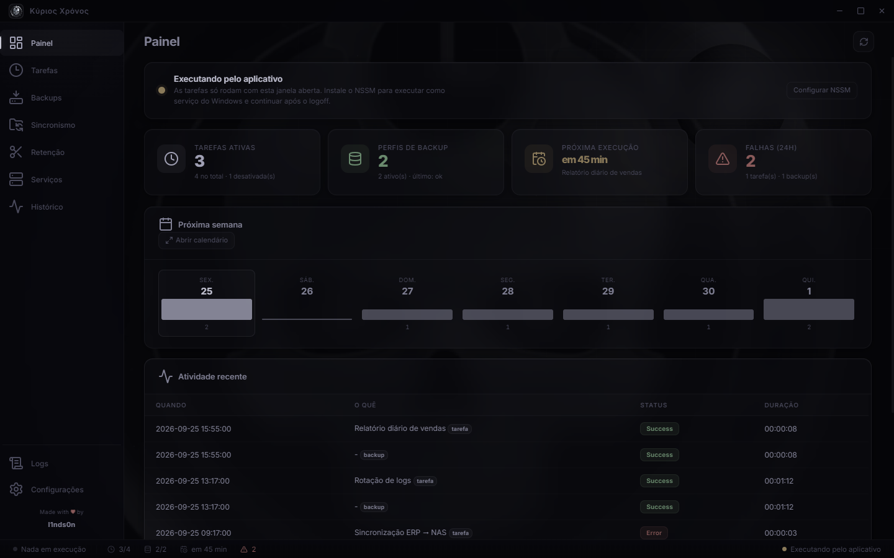
</p>

<p align="center"><strong>Kyrios Chronos — Κύριος Χρόνος</strong><br>Agendamento, backup, sincronismo, retenção e serviços Windows em um único aplicativo.</p>

#Windows #Electron #TaskScheduler #Cron #NSSM #WindowsService #MySQL #MariaDB #SQLServer #DatabaseBackup #FolderSync #SFTP #SMB #BackupRetention #DevOps #PowerShell #Automation #SelfHosted #ElectronApp #NodeJS #OpenSource

> Agendador de tarefas moderno com suporte a cron, gerenciador de serviços do Windows e backup de bancos de dados.

Português | **[English](README.en.md)**

O **Kyrios Chronos** é um aplicativo desktop (Electron) para Windows que centraliza as operações que normalmente exigem cinco ferramentas separadas:

1. **Agendamento de tarefas** (scripts PowerShell, executáveis e batches) via expressões cron;
2. **Gerenciamento de serviços do Windows** via [NSSM](https://nssm.cc/), com instalação, Parameters e ciclo de vida;
3. **Backup agendado de bancos de dados** (MySQL/MariaDB e SQL Server) com upload FTP, SFTP ou SMB;
4. **Sincronismo de pastas** entre disco local, unidade mapeada, FTP, SFTP e SMB;
5. **Retenção segura de backups**, com análise por subpasta, prévia sem escrita e perfis agendados;
6. **Painel web e API REST** opcionais, servidos pelo serviço Windows e protegidos por login + allowlist.

## ✨ Funcionalidades

### 🗓️ Tarefas agendadas
- Expressões cron com validação, descrição em texto amigável e cálculo da próxima execução;
- Execução manual, histórico de execuções e exportação (JSON/CSV);
- **Importação/exportação de tarefas** em JSON;
- **Alerta de conflito de agenda**: avisa quando uma nova tarefa colide com janelas já ocupadas e sugere um horário livre;
- **Calendário** unificado mostrando tarefas, backups e serviços em uma mesma linha do tempo, com histograma de carga por hora;
- **Monitor de execuções ao vivo**: progresso e saída em tempo real das tarefas em andamento.

### 🛠️ Serviços do Windows (NSSM)
- Listagem de todos os serviços instalados com status;
- Instalação/desinstalação, start/stop/restart direto pela interface;
- Instalador de NSSM embutido (winget, chocolatey, scoop ou download manual);
- Edição de parâmetros do serviço (executável, diretório, argumentos, log de stdout/stderr, rotação de logs, prioridade);
- Renomeação de serviços preservando todos os parâmetros;
- **Deploy de tarefas e backups como serviço do Windows** com um clique — o app gera um wrapper PowerShell, registra o serviço via NSSM e configura restart automático em caso de falha.

### 💾 Backup de bancos de dados
- Perfis de backup com conexão, seleção de bancos e agendamento por cron;
- **MySQL/MariaDB** (via `mysqldump`, com detecção automática em PATH, XAMPP, WampServer, Laragon e MariaDB, ou download das ferramentas oficiais) e **SQL Server** (`.bak` nativo ou `.bacpac`);
- Padrões de nomenclatura, compressão (zip/7z), retenção local por dias;
- Upload automático para **FTP, SFTP ou SMB**, com teste de conexão;
- Histórico e estatísticas de sucesso/falha por perfil;
- Importação/exportação de perfis em JSON.

### 🔄 Sincronismo de pastas
- Perfis incrementais ou espelho entre disco local, FTP, SFTP e SMB;
- Agendamento cron e opción de vigiar a origem;
- Exclusões por padrão, proteção contra destino dentro da origem esymlinks;
- Simulação completa antes de executar: cópia, arquivos ignorados e retenção pós-copia;
- Histórico e status da última execução por perfil.

### 🧹 Retenção segura
- Execução manual ao vivo e perfis de retenção agendados por cron;
- Filtro nível 0 de formatos, com `.7z` e `.zip` por padrão e opção explícita de remover o filtro;
- Política padrão: 30 arquivos mais recentes + uma cópia por mês durante 12 meses;
- Idade, semanal, quinzenal, espaço livre e mínimo de segurança como regras avançadas;
- Análise independente de cada subpasta — cada uma recebe seu próprio padrão de nome de arquivo;
- Prévia obrigatória antes de excluir, agrupada por pasta e também em árvore de arquivos;
- Cada arquivo da árvore mostra o padrão detectado, a regra aplicada, a data e a origem da data.

### 🖥️ Experiência desktop
- Interface dark com ícones [Lucide](https://lucide.dev/), janela sem moldura nativa;
- **System tray** com ações rápidas (executar tarefas pendentes, atualizar dashboard);
- Iniciar com o Windows, iniciar minimizado, fechar para a bandeja;
- Notificações push de sucesso/falha de tarefas, backups e operações de serviço;
- **Bilíngue**: inglês e português (pt-BR).

### 📜 Auditoria e logs
- Log de aplicação, log de erros e **log de auditoria** (quem criou/alterou/executou o quê, e quando);
- Leitura de logs direto do disco — enxerga também o que o serviço rodou em outra sessão;
- Exportação de logs em TXT, CSV ou JSON.

---

## 🖼️ Tour visual das telas

As imagens abaixo são geradas automaticamente por `scripts/capture-readme-screenshots.js`, usando dados de demonstração e a mesma janela real do aplicativo. Elas não dependem de uma máquina de produção nem expõem credenciais.

### Painel e agenda unificada

<table>
<tr>
<td width="65%"></td>
<td width="35%">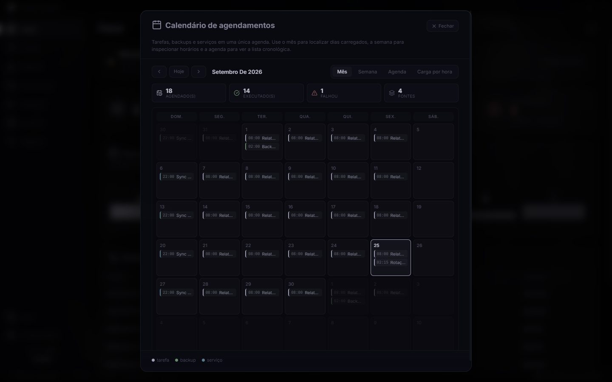</td>
</tr>
<tr>
<td><strong>Dashboard.</strong> Estado do agendador, tarefas ativas, perfis de backup, próxima execução, falhas de 24 horas e atividade recente em uma única tela.</td>
<td><strong>Calendário.</strong> Tarefas, backups e serviços projetados na mesma linha do tempo, com visões Mensal, Semana, Agenda e Carga por hora.</td>
</tr>
</table>

### Tarefas, criação rápida e histórico

<table>
<tr>
<td width="50%">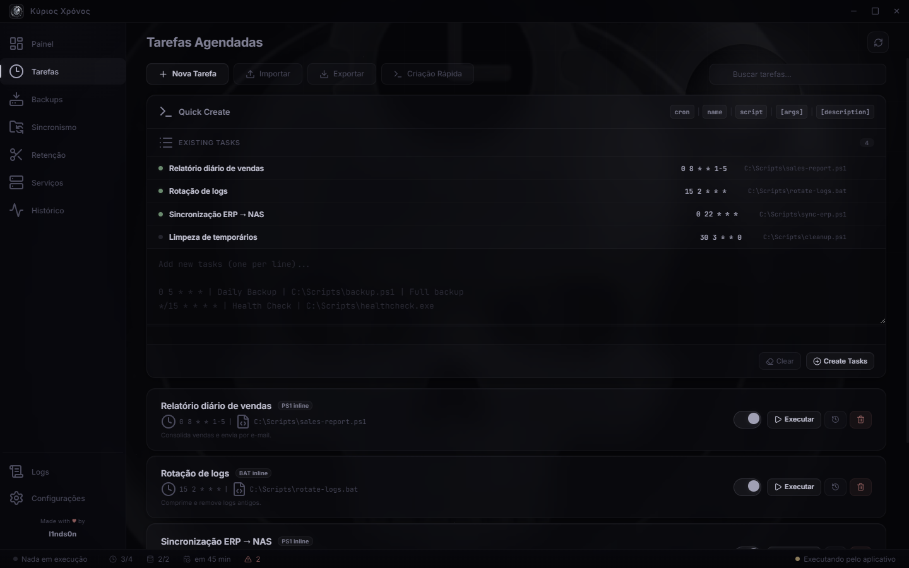</td>
<td width="50%">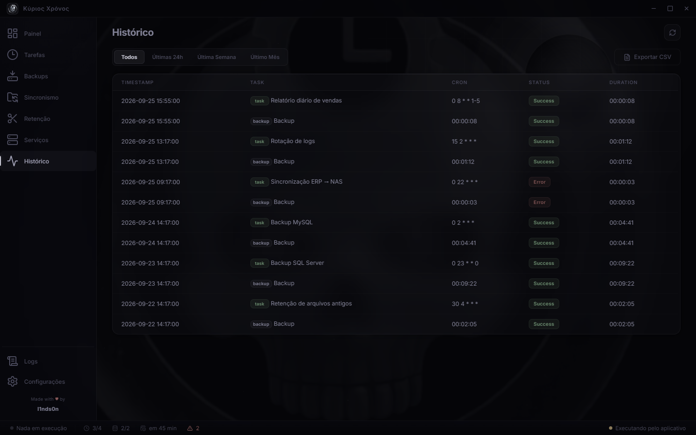</td>
</tr>
<tr>
<td><strong>Tarefas.</strong> Cron, script, argumentos e descrição em cards; execução manual, habilitação, histórico e criação rápida em lote.</td>
<td><strong>Histórico.</strong> Execuções de tarefas e backups no mesmo fluxo, filtráveis por período e exportáveis em CSV.</td>
</tr>
</table>

### Backups de banco de dados

<table>
<tr>
<td width="50%">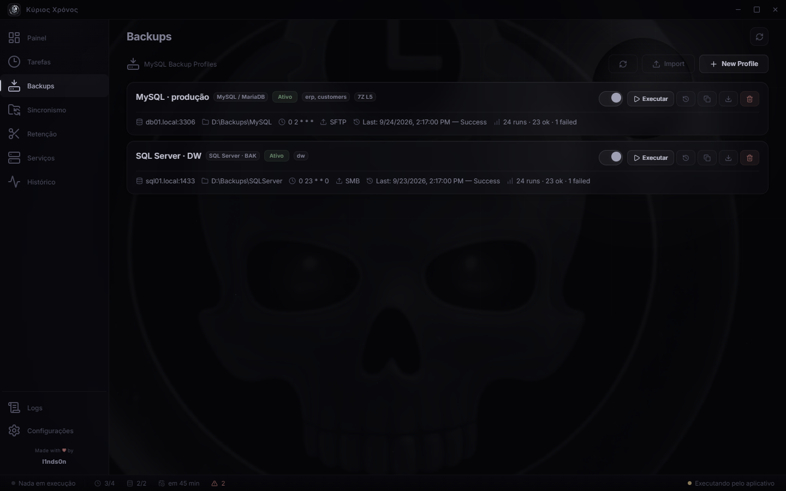</td>
<td width="50%">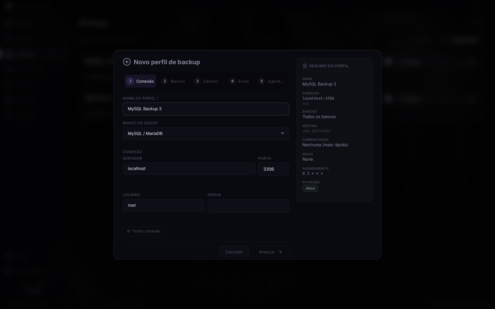</td>
</tr>
<tr>
<td><strong>Perfis de backup.</strong> Motor, destino, bancos, cron, upload, última execução e estatísticas em cards.</td>
<td><strong>Wizard em cinco etapas.</strong> Conexão, seleção de bancos, destino, upload e agenda, com resumo permanente ao lado.</td>
</tr>
</table>

### Sincronismo com retenção integrada

<table>
<tr>
<td width="50%">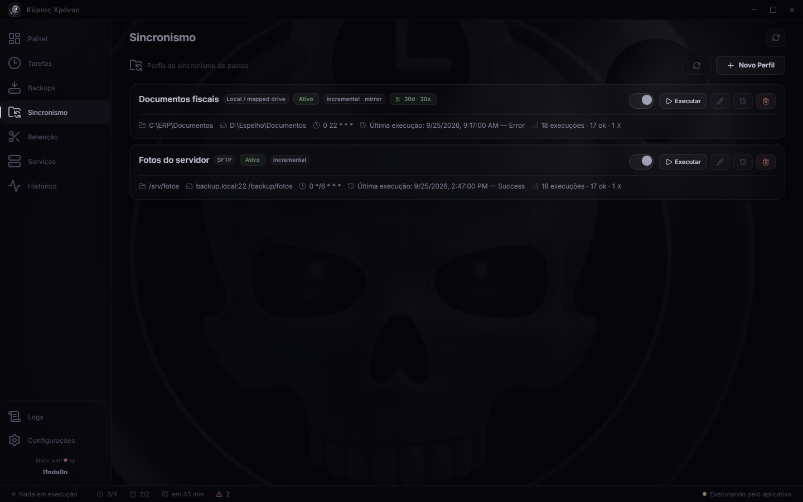</td>
<td width="50%">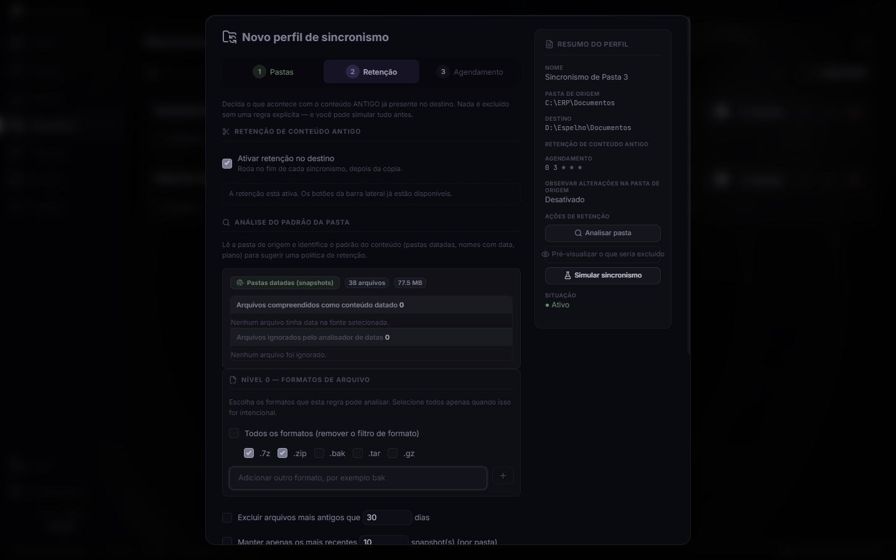</td>
</tr>
<tr>
<td><strong>Perfis de sync.</strong> Origem, destino, modo, espelho, retenção e estatísticas de execução.</td>
<td><strong>Retenção no destino.</strong> Análise do padrão, filtro de formatos, regras e prévia antes de qualquer exclusão.</td>
</tr>
</table>

### Retenção: prévia por pastas e árvore de arquivos

<table>
<tr>
<td width="50%">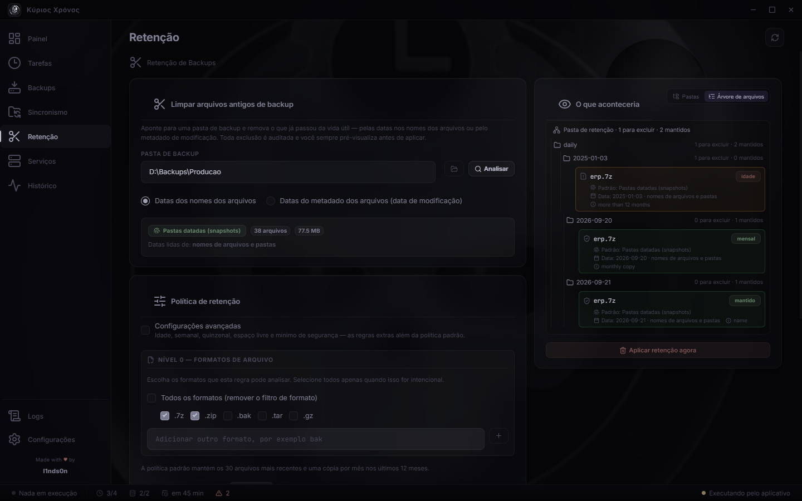</td>
<td width="50%">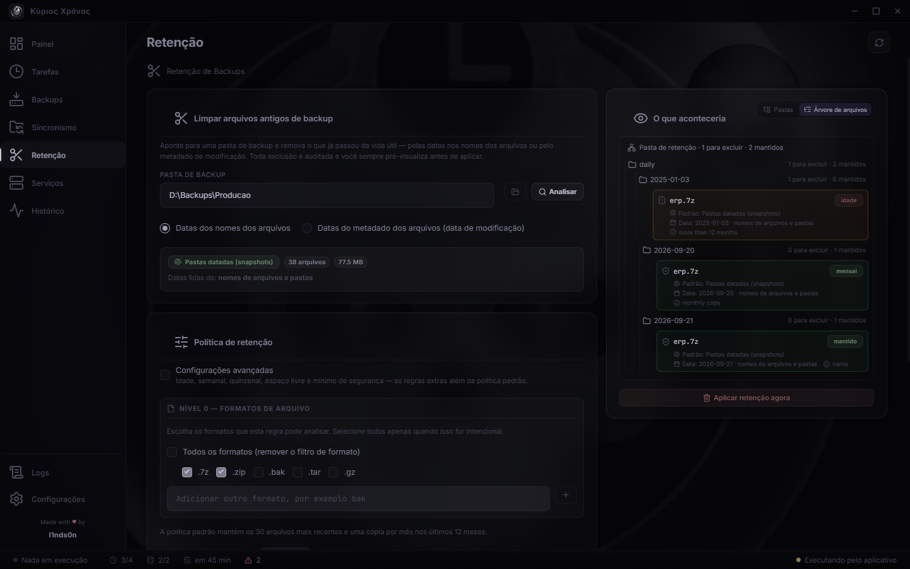</td>
</tr>
<tr>
<td><strong>Execução manual.</strong> Política padrão de 30 arquivos + 12 cópias mensais, com regras avançadas opcionais e prévia sempre visível.</td>
<td><strong>Árvore de retenção.</strong> Cada arquivo mostra em qual padrão de pasta se encaixa e por que será mantido ou excluído.</td>
</tr>
</table>

### Serviços, logs e configuração

<table>
<tr>
<td width="33%">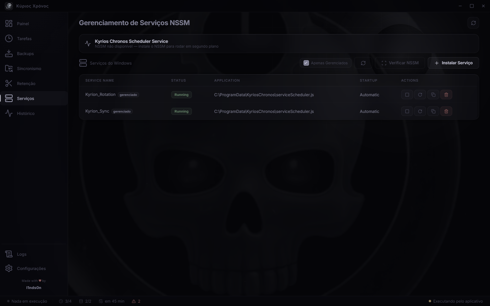</td>
<td width="33%">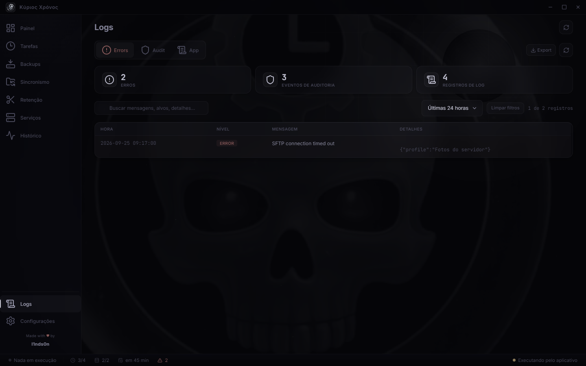</td>
<td width="33%">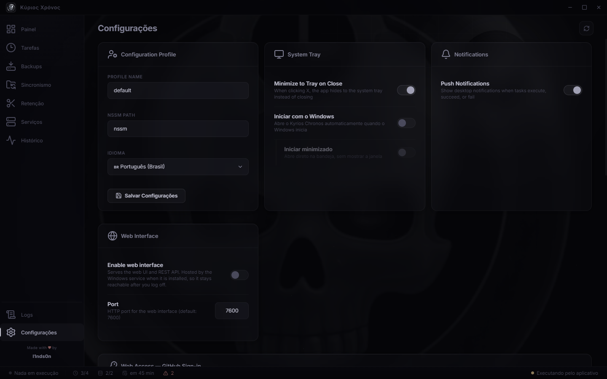</td>
</tr>
<tr>
<td><strong>Serviços.</strong> Iniciar, parar, reiniciar, clonar e instalar pelo NSSM.</td>
<td><strong>Logs.</strong> Erros, auditoria e aplicação com busca e exportação.</td>
<td><strong>Configurações.</strong> Perfil, NSSM, idioma, bandeja, notificações e acesso web.</td>
</tr>
</table>

### Gerar as imagens novamente

```bash
npx electron scripts/capture-readme-screenshots.js
```

O script carrega o renderer real em uma janela Electron isolada, simula apenas as respostas IPC necessárias e grava as imagens em `docs/screenshots/`.

---

## 🏗️ Arquitetura

O Kyrios Chronos pode rodar de duas formas — ou nas duas ao mesmo tempo:

| Modo | Descrição |
|------|-----------|
| **GUI** | O app Electron com janela, bandeja e notificações |
| **Serviço** | O agendador headless (`KyriosChronos`) rodando na sessão 0 via `ELECTRON_RUN_AS_NODE`, independente de usuário logado |

Para evitar que uma tarefa execute **duas vezes** quando a janela está aberta enquanto o serviço roda, os dois processos disputam a execução por um **arquivo de heartbeat** (`scheduler-owner.json`):

- O dono reescreve o arquivo a cada tick (15 s);
- Um disputante pode assumir quando o arquivo está ausente, obsoleto ou com PID morto;
- O serviço **sempre tem prioridade**: quando instalado, a GUI fica passiva (apenas visualização) e nunca retoma a execução enquanto o serviço estiver vivo.

### Dados compartilhados

Tudo vive em `%ProgramData%\KyriosChronos` (configurável via `KYRION_DATA_DIR`) — e não em `%APPDATA%` — porque a GUI roda como o usuário logado, enquanto o serviço roda como `LocalSystem`: são contas com `%APPDATA%` diferentes, mas `%ProgramData%` é compartilhado por ambas.

```
%ProgramData%\KyriosChronos\
├── config\            # tasks.json, backup-profiles.json, sync-profiles.json, retention-profiles.json, históricos e heartbeat
└── logs\              # app.log, erros, auditoria
```

### Interface web + API REST

O processo que detém a execução também serve uma **interface web** (Express, porta padrão `7600`) para administrar o sistema pelo navegador, com:

- **Login via GitHub** (OAuth device flow — nenhum segredo é embutido no app);
- **Allowlist deny-by-default**: ninguém acessa até um administrador liberar o login no app desktop;
- Cada operação pela web é atribuída à conta GitHub autenticada no log de auditoria;
- Métricas do sistema e atualizações em tempo real via SSE.

## 🚀 Começando

### Pré-requisitos
- **Node.js ≥ 16**
- **Windows** (NSSM, serviços e agendador são específicos de Windows)
- NSSM é opcional — o app pode instalá-lo para você

### Desenvolvimento

```bash
# clonar e instalar dependências
git clone https://github.com/l1nds0n/kyrios-chronos.git
cd kyrios-chronos
npm install

# rodar o app
npm start
```

### Testes

```bash
npm test
```

A suíte usa **Mocha + Chai** (`tests/*.js`, timeout de 60 s) e cobre parser cron, dados de calendário, registro de execuções, ícone do app, telas de log e mais. Use `KYRION_DATA_DIR` para apontar os testes para um diretório de dados temporário.

### Build de produção

```bash
# instalador NSIS + portable (electron-builder)
npm run build

# somente portable via electron-packager
npm run build:portable

# script completo (requer NSIS 3.x: choco install nsis)
.\Build-Installer.ps1              # ambos
.\Build-Installer.ps1 -Portable    # só o portable
.\Build-Installer.ps1 -Installer   # só o instalador
```

Artefatos gerados em `dist/`:
- `KyriosChronos Setup <versão>.exe` — instalador NSIS (atalhos na área de trabalho e menu iniciar, escolha de diretório);
- `KyriosChronos-<versão>-portable.exe` — versão portátil sem instalação.

## 📁 Estrutura do projeto

```
kyrios-chronos/
├── src/
│   ├── main/              # Processo principal do Electron
│   │   ├── main.js        # Janela, bandeja, IPC, notificações
│   │   ├── schedulerCore.js    # Motor de agendamento compartilhado (GUI + serviço)
│   │   ├── taskManager.js      # CRUD, execução e histórico de tarefas
│   │   ├── backupManager.js    # Perfis e execução de backups
│   │   ├── retentionManager.js # Perfis de retenção agendados e lock por pasta
│   │   ├── sync/               # Perfis de sync e motor de retenção por subpasta
│   │   ├── serviceManager.js   # Operações NSSM
│   │   ├── kyrionService.js    # Serviço headless KyriosChronos
│   │   ├── apiServer.js        # Interface web + API REST
│   │   ├── webAuth.js          # Login GitHub (device flow) e allowlist
│   │   ├── db/                 # Registro de motores de backup (mysql, sqlserver)
│   │   └── ...
│   ├── renderer/          # Interface desktop (HTML/CSS/JS, i18n)
│   └── web/               # Interface web servida pela API
├── tests/                 # Suíte Mocha + Chai
├── docs/screenshots/      # Imagens do tour visual geradas por automação
├── scripts/               # Empacotamento e captura automatizada de screenshots
├── installer/             # Scripts NSIS
└── build-resources/       # Ícones e artefatos visuais
```

## 🔌 API REST

Quando habilitada nas configurações (desabilitada por padrão), a interface web/API expõe endpoints para gerenciar tarefas, serviços, backups, sincronismo, retenção, histórico e logs em `http://localhost:7600`. Endpoints públicos antes do login: `/login`, `/api/health`.

## 🔒 Notas de segurança

- O segredo OAuth do GitHub **não é embutido** no app: usa-se o *device flow*, feito para clientes que não podem guardar segredos (um `.asar` é apenas um arquivo, não um cofre);
- Acesso à web é **negado por padrão** até que um administrador adicione logins à allowlist;
- Sessões web: cookie `HttpOnly` assinado com TTL de 12 h;
- Credenciais de banco e de upload ficam nos perfis em `%ProgramData%` — proteja o diretório adequadamente.

## 📄 Licença

[MIT](LICENSE) © l1nds0n
